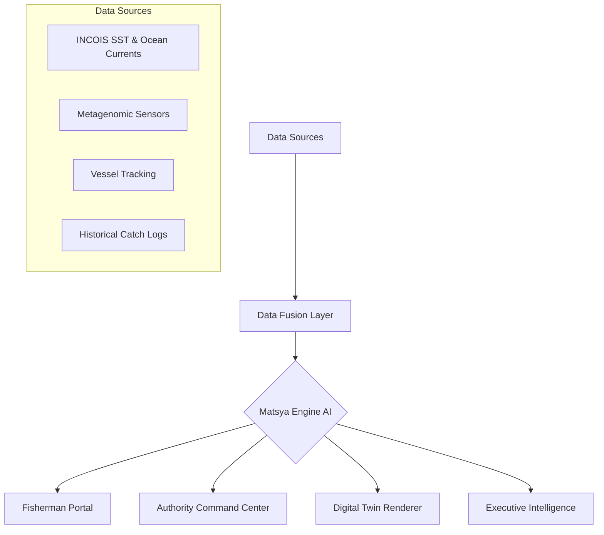

# 🌊 MatsyaDrishti (OceanSync AI)

 <!-- Replace with actual banner image -->

> **An AI-powered Coastal Ecosystem Digital Twin for Sustainable Ocean Management**

---

## 1. Project Overview
**MatsyaDrishti** (Sanskrit for "Fish Vision") is a state-of-the-art marine intelligence platform. It fuses real-time satellite telemetry from INCOIS, eDNA biodiversity sampling, historical fisheries records, and AIS vessel tracking into a unified 4D Digital Twin. The platform empowers fishermen, researchers, and government authorities to make data-driven, sustainable decisions regarding ocean resources.

## 2. Problem Statement
Global marine ecosystems face unprecedented threats from:
* **Overfishing & Depletion:** Unregulated harvesting threatens critical species populations.
* **Climate Change:** Rising Sea Surface Temperatures (SST) cause coral bleaching and force species migration.
* **Lack of Real-Time Intelligence:** Fishermen waste fuel searching for catch, while authorities lack actionable data to enforce marine protected areas (MPAs) dynamically.

## 3. Solution
MatsyaDrishti provides a unified intelligence layer—**Matsya Engine**—that acts as the central nervous system for coastal ecosystems. By predicting fish aggregation zones with high confidence and simultaneously monitoring biodiversity stress factors, the platform optimizes fishing productivity while actively preventing ecological collapse. 

## 4. Key Features
* 🌍 **Immersive 4D Digital Twin:** Full-viewport interactive ocean mapping with 8 toggleable telemetry layers.
* 🧠 **Matsya Engine AI Core:** Deep Ensemble (v3.2) predicting species distribution and environmental risks.
* 📊 **Executive Intelligence Center:** Automated report generation, historic trends, and compliance auditing.
* 🌡️ **Climate Impact Analytics:** 2030–2050 ecosystem trajectory forecasting and adaptive recommendations.
* 🚢 **Role-Based Portals:** Dedicated dashboards for Fishermen (Route optimization) and Authorities (Mission Control).

---

## 5. System Architecture



## 6. Technology Stack
* **Frontend:** Next.js 15, React 19, TypeScript
* **Styling & UI:** Tailwind CSS v4, Framer Motion (Premium Animations), Glassmorphism UI
* **Visualization:** Custom HTML5 Canvas (Digital Twin), Recharts
* **Architecture:** App Router, Server Components

## 7. AI Workflow
1. **Data Ingestion:** Receives multi-modal data streams (SST, Chlorophyll-a, eDNA richness).
2. **Feature Extraction:** Spatial alignment and temporal normalization of environmental variables.
3. **Inference:** The Deep Ensemble model processes data through Geospatial Transformers and Species Distribution Models.
4. **Explainability (XAI):** Ranks feature importance (e.g., "SST anomaly is the primary driver").
5. **Actionable Output:** Generates predictive zones for harvesting or immediate conservation alerts.

## 8. Digital Twin Workflow
The Digital Twin acts as a 4D spatial canvas. Users can:
* **Toggle Layers:** Overlay ocean currents, temperature regions, coral health zones, and fish clusters.
* **Temporal Scrubbing:** Move backward to analyze historical trends, or forward to view AI-generated future ecosystem states.
* **Sector Telemetry:** Hover over specific grid sectors to pull real-time health and risk metrics.

## 9. User Roles
* **Fishermen:** Access route optimizers, safe fishing zones, storm alerts, and catch efficiency predictions.
* **Conservation Authorities:** Monitor protected zones, coral stress, and deploy rapid-response teams.
* **Researchers/Executives:** Generate high-level ecosystem health reports and track 10-year climate impacts.

---

## 10. Installation

### Prerequisites
* Node.js 18.17 or later
* npm, yarn, or pnpm
* Git

```bash
# Clone the repository
git clone https://github.com/your-org/matsyadrishti.git

# Navigate to project directory
cd matsyadrishti

# Install dependencies
npm install
```

## 11. Local Setup

```bash
# Start the development server
npm run dev
```
Open [http://localhost:3000](http://localhost:3000) with your browser to see the result. 

### Available Routes:
* `/` - Landing Page
* `/fisherman` - Fisherman Dashboard
* `/authority` - Authority Command Center
* `/digital-twin` - Coastal Ecosystem Digital Twin
* `/ai-center` - Matsya Engine AI Center
* `/climate` - Climate Impact Analytics
* `/reports` - Executive Intelligence Center

---

## 12. Screenshots Placeholders

| Digital Twin | AI Intelligence Center |
|---|---|
|  |  |
| **Authority Dashboard** | **Climate Analytics** |
|  |  |

*(Note: Add your actual screenshots to the `public/screenshots` directory).*

---

## 13. Future Scope
* **Real-time Mapbox GL Integration:** Moving from conceptual 4D canvas to true geospatial rendering.
* **Supabase Integration:** Live webhook feeds for actual AIS vessel data and INCOIS API endpoints.
* **Mobile-Native App:** Field application for fishermen with offline-first capabilities.
* **Edge Computing Nodes:** Deploying ML models directly to offshore sensor buoys for reduced latency.

## 14. Team Members
* **[Your Name/Team Name]** - Hackathon Participant(s)

## 15. License
This project is licensed under the MIT License - see the [LICENSE](LICENSE) file for details.
